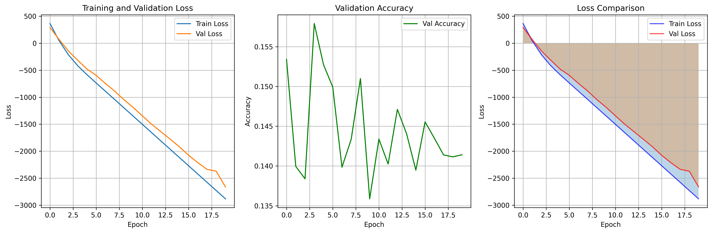

# BiLSTM-CRF 中文分词实验结果

## 训练与验证指标

-   **训练轮数**：20
-   **字符词表大小**：5169
-   **模型参数量**：1,322,398
-   **最终训练损失**：-2882.6780
-   **最终验证损失**：-2662.8617
-   **最终验证准确率**：0.1414

### 训练过程可视化

-   **训练/验证损失与验证准确率曲线**：

### 训练与验证历史

| Epoch | 训练损失 (Train Loss) | 验证损失 (Val Loss) | 验证准确率 (Val Accuracy) |
| ----- | --------------------- | ------------------- | ------------------------- |
| 1     | 364.29                | 289.98              | 0.1534                    |
| 2     | 41.80                 | 66.69               | 0.1399                    |
| 3     | -215.57               | -145.68             | 0.1384                    |
| 4     | -417.46               | -315.08             | 0.1579                    |
| 5     | -582.77               | -478.65             | 0.1527                    |
| 6     | -736.84               | -594.98             | 0.1499                    |
| 7     | -889.36               | -745.99             | 0.1398                    |
| 8     | -1042.61              | -886.89             | 0.1434                    |
| 9     | -1196.55              | -1046.64            | 0.1510                    |
| 10    | -1349.41              | -1188.79            | 0.1359                    |
| 11    | -1502.78              | -1345.57            | 0.1434                    |
| 12    | -1656.32              | -1500.13            | 0.1403                    |
| 13    | -1809.36              | -1638.01            | 0.1471                    |
| 14    | -1962.86              | -1775.90            | 0.1440                    |
| 15    | -2116.22              | -1917.16            | 0.1395                    |
| 16    | -2269.53              | -2075.38            | 0.1456                    |
| 17    | -2422.90              | -2212.65            | 0.1435                    |
| 18    | -2576.33              | -2335.97            | 0.1414                    |
| 19    | -2729.95              | -2371.38            | 0.1412                    |
| 20    | -2882.68              | -2662.86            | 0.1414                    |

> 详细训练历史已保存至 `training_history.json`。

---

## 分词结果对比（最大匹配 vs. BiLSTM-CRF）

下表为实验中分词算法对比的部分结果。

| 句子                         | 最大匹配                                       | BiLSTM 分词                                       |
| ---------------------------- | ---------------------------------------------- | ------------------------------------------------- |
| 我爱北京天安门               | 我 / 爱 / 北京 / 天安门                        | 我 / 爱 / 北京 / 天 / 安门                        |
| 机器学习是人工智能的重要分支 | 机器 / 学习 / 是 / 人工智能 / 的 / 重要 / 分支 | 机器 / 学习 / 是 / 人工 / 智能 / 的 / 重要 / 分支 |
| 今天天气很好                 | 今天 / 天气 / 很 / 好                          | 今天 / 天气 / 很 / 好                             |
| 自然语言处理技术发展迅速     | 自然 / 语言 / 处理 / 技术 / 发展 / 迅速        | 自然 / 语言 / 处理 / 技术 / 发展 / 迅速           |
| 北京大学是著名的高等学府     | 北京大学 / 是 / 著名 / 的 / 高等 / 学府        | 北京大学 / 是 / 著 / 的 / 高等 / 学 / 府          |

> 详细分词结果（含词数统计）见 `segmentation_results.json` 与 `segmentation_comparison.csv`。

---

## 产出

-   **训练历史与曲线**：

    -   `training_history.json` - 训练与验证损失、准确率记录。
    -   `training_curves.png` - 训练与验证损失、准确率曲线图。

-   **分词结果对比**：

    -   `segmentation_results.json` - 各测试句子的最大匹配与 BiLSTM 分词对比结果。
    -   `segmentation_comparison.csv` - 分词方法对比表，包含原文与分词结果。

-   **最大匹配过程的详细输出**：
    -   `max_match_forward_result.txt` - 正向最大匹配分词结果。
    -   `max_match_backward_result.txt` - 反向最大匹配分词结果。
    -   `max_match_bidirectional_result.txt` - 双向最大匹配分词结果。

> 所有结果文件均已保存至指定目录。

---

## 实验总结

### 数据集

-   **数据集名称**：MSR 中文分词数据集

### 训练与测试

-   **训练样本数**：86918
-   **测试样本数**：3985
-   **字符词汇表大小**：5169
-   **模型参数数量**：1,322,398

### 训练过程

-   **训练轮数**：20
-   **最终验证准确率**：0.1414
-   **最终训练损失**：-2882.6780
-   **最终验证损失**：-2662.8617

### 使用设备

-   **设备**：cuda
