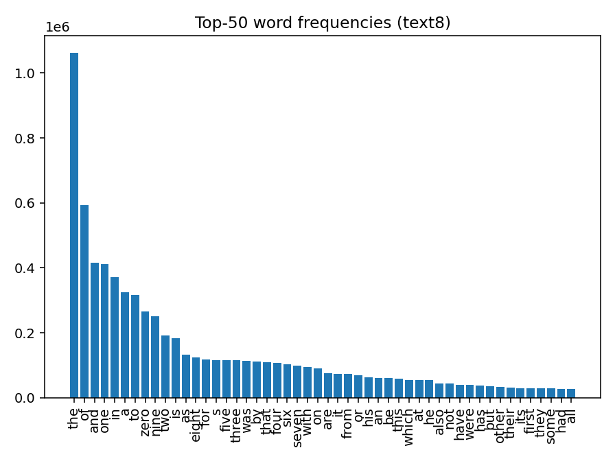
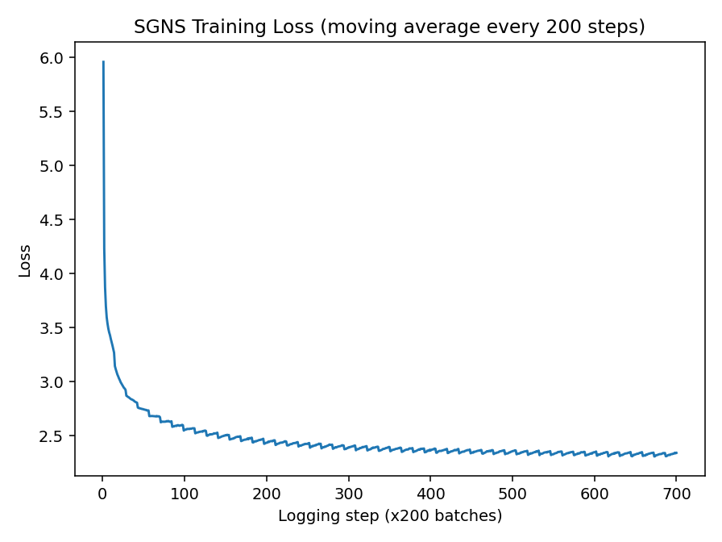
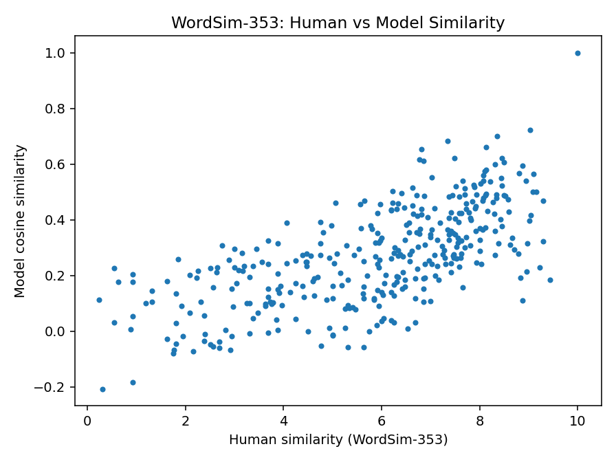

# 基于负采样（Negative Sampling）的 Skip-gram 词向量实验

> 数据集：**text8**（训练）
> 训练实现：PyTorch + 自定义 SGNS（Skip-gram with Negative Sampling）
> 可视化：matplotlib

## 背景与目标

词向量（word embeddings）通过在大规模语料上学习，将离散的词映射为连续向量，使语义/语法相近的词在向量空间中更接近。**Skip-gram** 模型以中心词预测上下文词，**负采样（Negative Sampling）**通过将全词表多类分类问题转化为一系列二分类任务，大幅降低训练复杂度并保留高质量表示。

本实验目标：在 **text8** 语料上训练 SGNS 词向量，完整呈现数据处理与训练流程，并产出训练相关可视化以辅助分析。

---

## 模型原理

### Skip-gram 基本思想

给定语料序列 $\{w_1,\dots,w_T\}$，在位置 $t$ 的中心词 $w_t$ 周围的窗口 $[t-R, t+R]\setminus\{t\}$ 中出现的词被视为正样本上下文。Skip-gram 的理想目标是最大化中心词对上下文词的预测概率。

若使用标准 softmax，则对于上下文词 $o$：

$$
P(o \mid c) = \frac{\exp(u_o^\top v_c)}{\sum_{w=1}^{V}\exp(u_w^\top v_c)},
$$

其中 $v_c$ 为中心词 $c$ 的输入嵌入，$u_o$ 为上下文词 $o$ 的输出嵌入，$V$ 为词表大小。该计算需遍历全词表，成本过高。

### 负采样（SGNS）

**负采样**将上述多类问题改写为一系列二分类任务：对于每个正样本对 $(c,o)$，从噪声分布 $P_n(w)$ 采样 $K$ 个词 $\{n_1,\dots,n_K\}$ 作为“非上下文”的负样本。SGNS 的单对样本对数似然为：

$$
\ell(c,o) \;=\; \log \sigma(u_o^\top v_c) \;+\; \sum_{k=1}^{K} \log \sigma\!\big(-u_{n_k}^\top v_c\big),
$$

其中 $\sigma(x)=\frac{1}{1+\exp(-x)}$。

训练时通常**最小化负对数似然**（取负号并对 batch 求均值）。与 NCE（Noise-Contrastive Estimation）相关，SGNS 可视为对 PMI 的隐式分解（Mikolov 等，2013；Levy & Goldberg，2014）。

**噪声分布**：经验上取 $P_n(w)\propto U(w)^{3/4}$，其中 $U(w)$ 为词频分布，幂次 $0.75$ 在实践中兼顾高频与低频词的采样质量与训练稳定性。

### 梯度推导

设

$$
s_p=\sigma(u_o^\top v_c),\qquad s_{n_k}=\sigma(u_{n_k}^\top v_c).
$$

则对**最大化** $\ell(c,o)$ 的梯度为：

$$
\begin{aligned}
\frac{\partial \ell}{\partial v_c} &= (1-s_p)\,u_o \;-\;\sum_{k=1}^{K} s_{n_k}\,u_{n_k},\\[4pt]
\frac{\partial \ell}{\partial u_o} &= (1-s_p)\,v_c,\\[4pt]
\frac{\partial \ell}{\partial u_{n_k}} &= -\,s_{n_k}\,v_c,\quad k=1,\dots,K.
\end{aligned}
$$

在代码中我们最小化 $-\ell$ 的 batch 均值，所以实现里的反向传播与上式仅差一个整体符号。该推导来自：

$$
\frac{d}{dx}\log\sigma(x)=1-\sigma(x),\qquad
\frac{d}{dx}\log\sigma(-x)=-\sigma(x).
$$

---

## 数据与预处理

### 训练语料：text8

- 维基百科英文 dump 的子集，约 17M token，纯小写、空格分词。
- 预处理：统计词频，过滤 **MIN_COUNT = 5**；其余映射为 `<UNK>`。
- 子采样（Subsampling）缓解高频词主导问题，保留概率：

$$
P_{\text{keep}}(w)=\big(\sqrt{f(w)/t}+1\big)\cdot\frac{t}{f(w)},
$$

其中 $f(w)$ 为词相对频率，实验设 $t=10^{-5}$。

### 可视化：词频直方图



---

## 实验设置

- **嵌入维度** `EMBED_DIM = 100`
- **最大窗口** `WINDOW_SIZE = 5`
- **负样本数** `NEG_K = 10`
- **Batch 大小** `BATCH_SIZE = 2048`
- **优化器** Adam，`LR = 0.002`
- **训练轮次** `EPOCHS = 50`
- **负采样分布** $P_n(w)\propto U(w)^{0.75}$
- **设备**：自动选择 MPS / CUDA / CPU；

---

## 代码实现摘录

### 负采样分布与采样器

```python
# Build negative sampling distribution (unigram^0.75)
counts = np.zeros(vocab_size, dtype=np.float64)
for w, c in freq.items():
    wid = stoi.get(w, stoi[UNK])
    counts[wid] += c
neg_dist = counts ** 0.75
neg_dist = neg_dist / neg_dist.sum()
neg_dist_t = torch.tensor(neg_dist, dtype=torch.float)

class NegativeSampler:
    def __init__(self, dist: torch.Tensor):
        self.dist = dist  # sums to 1

    def sample(self, num_samples: int):
        return torch.multinomial(self.dist, num_samples=num_samples, replacement=True)
```

### Skip-gram 训练样本生成（随机窗口）

```python
class SkipGramDataset(Dataset):
    def __init__(self, token_ids: np.ndarray, window_size: int):
        self.ids = token_ids
        self.window_size = window_size

    def __getitem__(self, idx):
        center = self.ids[idx]
        w = random.randint(1, self.window_size)
        while True:
            offset = random.randint(-w, w)
            if offset != 0 and 0 <= idx + offset < len(self.ids):
                context = self.ids[idx + offset]
                break
        return int(center), int(context)
```

### SGNS 前向与损失（对应 $-\ell$ 的均值）

```python
class SGNS(nn.Module):
    def __init__(self, vocab_size: int, embed_dim: int):
        super().__init__()
        self.in_embed = nn.Embedding(vocab_size, embed_dim)
        self.out_embed = nn.Embedding(vocab_size, embed_dim)
        self._init_weights()

    def _init_weights(self):
        bound = 0.5 / EMBED_DIM
        nn.init.uniform_(self.in_embed.weight, -bound, bound)
        nn.init.constant_(self.out_embed.weight, 0.0)

    def forward(self, center_ids, pos_context_ids, neg_ids):
        v = self.in_embed(center_ids)            # (B, D)
        u_pos = self.out_embed(pos_context_ids)  # (B, D)
        u_neg = self.out_embed(neg_ids)          # (B, K, D)

        pos_score = torch.sum(v * u_pos, dim=1)                  # (B,)
        neg_score = torch.bmm(u_neg, v.unsqueeze(2)).squeeze(2)  # (B, K)

        pos_loss = torch.log(torch.sigmoid(pos_score) + 1e-12)
        neg_loss = torch.log(torch.sigmoid(-neg_score) + 1e-12).sum(1)
        loss = -(pos_loss + neg_loss).mean()
        return loss
```

### 训练

```python
from tqdm import tqdm

train_losses = []
log_interval = 200

for epoch in range(1, EPOCHS + 1):
    model.train()
    running, ema_loss = 0.0, None
    with tqdm(total=len(loader), desc=f"Epoch {epoch}/{EPOCHS}", dynamic_ncols=True, leave=True) as pbar:
        for step, (centers, contexts, negatives) in enumerate(loader, start=1):
            centers, contexts, negatives = centers.to(device), contexts.to(device), negatives.to(device)
            optimizer.zero_grad(set_to_none=True)
            loss = model(centers, contexts, negatives)
            loss.backward()
            optimizer.step()

            val = loss.item()
            running += val
            ema_loss = val if ema_loss is None else 0.98 * ema_loss + 0.02 * val

            if step % log_interval == 0:
                train_losses.append(running / log_interval)
                running = 0.0

            pbar.set_postfix(loss=f"{ema_loss:.4f}")
            pbar.update(1)
```

---

## 训练与可视化

### 训练损失曲线



- **整体趋势**：损失从约 **6.0** 迅速降至 **≈3.0**（左侧几百个 batch 内），随后以更缓的速度降到 **≈2.33–2.36** 并进入平台期。横轴为 _logging step ×200 batches_，最右侧 **700** 约等于 **14 万** 个 batch，说明模型在前期已学到大部分可分离的局部共现信号，后期回报递减。
- **波动来源**：中后段出现 **0.02–0.05** 幅度的锯齿状起伏，符合 **负采样方差** 与 **随机窗口/数据重洗** 引入的噪声特征；EMA（指数滑动平均）使曲线更平滑但仍保留周期性波动。
- **收敛性**：未见失控上升或剧烈震荡，学习过程稳定；平台期的斜率接近 0，继续等量训练带来的改进会非常有限。
- **可操作建议**：

  1. 在平台期引入 **学习率衰减**（Cosine/StepLR 或 AdamW+warmdown）以进一步压低损失并抑制振荡；
  2. 适度增大 **负样本数 K（如 15–20）** 或 **batch size** 以降低估计方差（训练更慢但更稳）；
  3. 对 **输出嵌入** 增加轻度 **L2 正则** 或采用 **in/out 平均向量** 用于下游相似度计算，常能带来小幅但稳定的收益；
  4. 若算力允许，可将 **维度提升至 200** 并配合更长训练或更大窗口上限，以换取更强的表示容量。

### WordSim-353：人工相似度 vs. 模型余弦相似度



- **相关性**：散点整体沿对角线分布，呈显著正相关；以完整覆盖 **353/353** 个词对计算，**Spearman = 0.6867**，在 **text8 + SGNS(100d, K=10)** 的规模下属于良好水平。
- **分段特征**：

  - 人工分数 **7–10** 区间的点云更稀疏但方差更大，说明模型已能区分强同义/近义，但受语料规模与多义性影响，个别高分对的余弦仍偏低；
  - 低分区（**0–3**）偶有余弦偏高的离群点，典型于**主题相关/共现强**但**语义不相似**（或反义词）导致分布式相似度被抬高。

## 评测方案与指标

### 最近邻与定性检查

训练后使用 **输入嵌入** $E = W_\text{in}$ 进行相似词检索（cosine），对 “king/queen/man/woman/paris/…” 等常见词的近邻进行定性检查，验证语义连贯性与词类聚集现象。

### WordSim-353（斯皮尔曼相关）

- `Pairs used: 353/353`（其余因 OOV 被剔除）
- `WordSim-353 Spearman correlation: 0.6867`
