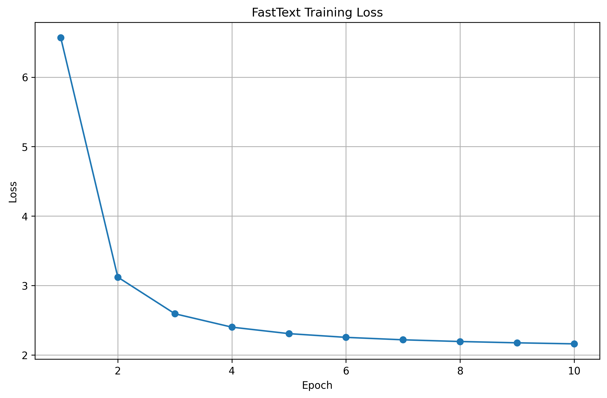
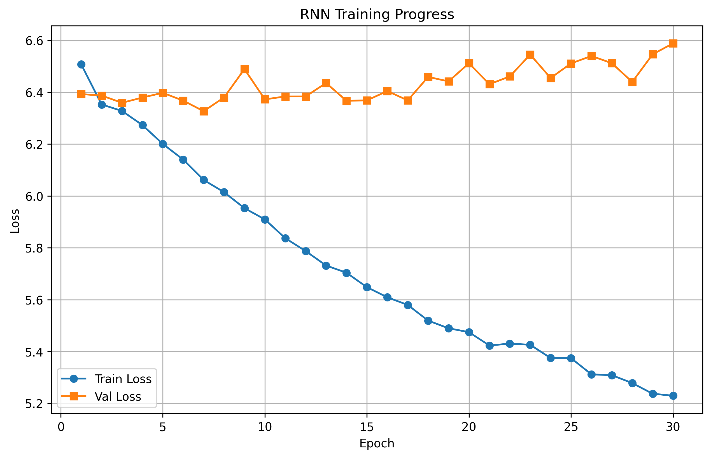
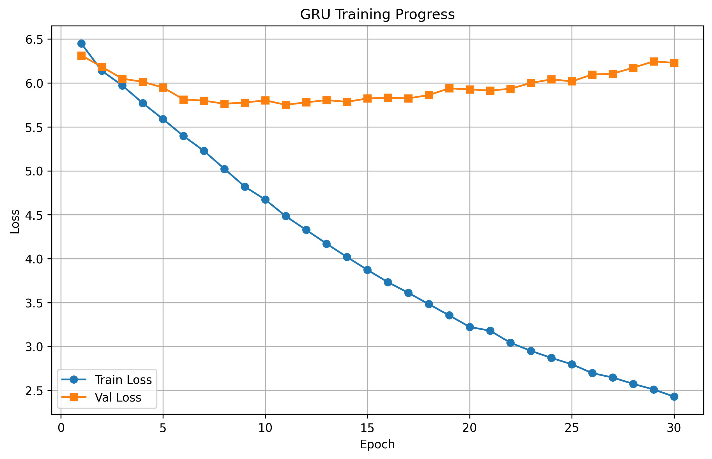
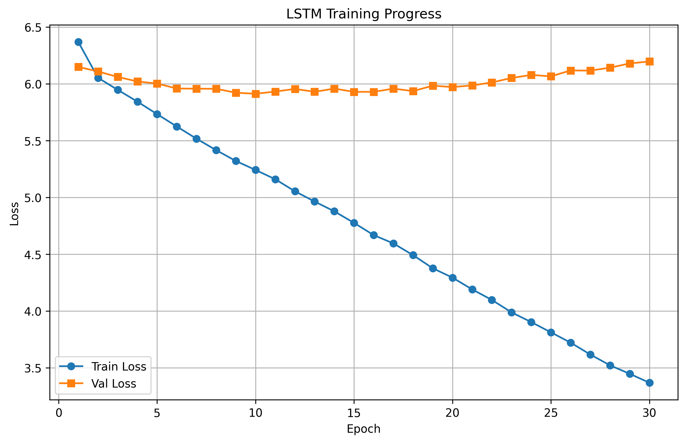
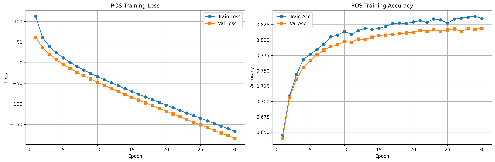
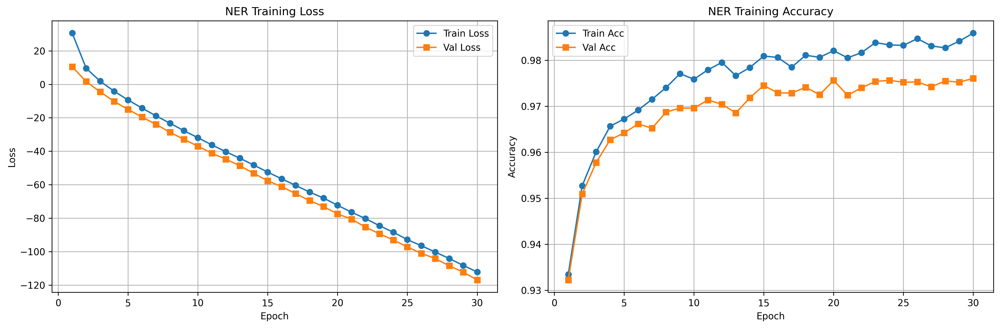

# NLP Week3 - 2022213670

## 实验概述

本实验实现了三个主要的自然语言处理任务：

1. **FastText 词向量训练** - 使用 Skip-gram with Negative Sampling 和 subword information
2. **Seq2Seq 天津话到普通话翻译** - 基于 RNN/GRU/LSTM 的序列到序列模型
3. **Character-level POS 和 NER 标注** - 使用 BiLSTM-CRF 模型进行词性标注和命名实体识别

## 1. FastText 词向量训练

### 1.1 模型架构

-   **模型类型**: Skip-gram with Negative Sampling + Subword Information
-   **词嵌入维度**: 100
-   **窗口大小**: 5
-   **负采样数量**: 5
-   **N-gram 范围**: 3-6

### 1.2 训练结果

#### 训练损失曲线



#### 训练过程数据

根据训练历史记录，FastText 模型的损失变化如下：

-   初始损失: 6.57
-   第 2 轮: 3.12
-   第 3 轮: 2.59
-   第 4 轮: 2.40
-   第 5 轮: 2.31
-   第 6 轮: 2.25
-   第 7 轮: 2.22
-   第 8 轮: 2.19
-   第 9 轮: 2.17
-   最终损失: 2.16

训练过程显示损失稳步下降，模型收敛良好。

### 1.3 模型输出

-   **词汇表大小**: 约 15,000 个词汇
-   **词向量文件**: `model/fasttext_embeddings.json`
-   **模型文件**: `model/fasttext_model.pth`

## 2. Seq2Seq 天津话到普通话翻译

### 2.1 模型架构

实现了三种不同的 RNN 架构进行对比：

-   **RNN**: 基础循环神经网络
-   **GRU**: 门控循环单元
-   **LSTM**: 长短期记忆网络

所有模型都采用了：

-   编码器-解码器架构
-   注意力机制
-   Teacher Forcing 训练策略

### 2.2 训练结果

#### RNN 模型



#### GRU 模型



#### LSTM 模型



### 2.3 翻译示例

#### LSTM 模型翻译结果

```json
[
	{
		"source": "苏大夫本名苏金散",
		"translation": "苏大夫为名苏名金"
	},
	{
		"source": "民国初年在小白楼一带",
		"translation": "民初初在在海在小山"
	},
	{
		"source": "正骨拿环",
		"translation": "接骨矫正"
	},
	{
		"source": "天津卫挂头牌",
		"translation": "天津卫的天津"
	}
]
```

## 3. Character-level POS 和 NER 标注

### 3.1 模型架构

-   **模型类型**: BiLSTM-CRF
-   **字符嵌入维度**: 100
-   **隐藏层维度**: 256
-   **LSTM 层数**: 2
-   **Dropout**: 0.5

### 3.2 POS 标注结果

#### 训练曲线



#### 训练过程

POS 标注模型训练了 50 个 epoch，训练损失从 112.52 逐步下降到-154.33，显示模型学习效果良好。

#### 预测示例

```
文本: "克鲁吉是应外经贸部的邀请来华访问的。"
真实标签: ["nr", "nr", "nr", "v", "v", "j", "j", "j", "j", "u", "vn", "vn", "v", "v", "v", "v", "u", "w"]
预测标签: ["nr", "nr", "nr", "v", "v", "j", "j", "j", "j", "u", "vn", "vn", "v", "v", "v", "v", "u", "w"]
```

### 3.3 NER 标注结果

#### 训练曲线



#### 预测示例

```
文本: "大涧村位于距禹州市36公里的伏牛山麓深山区"
真实标签: ["B-LOC", "I-LOC", "I-LOC", "O", "O", "O", "B-LOC", "I-LOC", "I-LOC", "O", "O", "O", "O", "O", "B-LOC", "I-LOC", "O"]
预测标签: ["B-LOC", "I-LOC", "I-LOC", "O", "O", "O", "B-LOC", "I-LOC", "I-LOC", "O", "O", "O", "O", "O", "B-LOC", "I-LOC", "O"]
```

## 4. 模型文件总结

### 4.1 训练好的模型

-   `fasttext_model.pth` - FastText 词向量模型
-   `seq2seq_rnn_best.pth` / `seq2seq_rnn_final.pth` - RNN 翻译模型
-   `seq2seq_gru_best.pth` / `seq2seq_gru_final.pth` - GRU 翻译模型
-   `seq2seq_lstm_best.pth` / `seq2seq_lstm_final.pth` - LSTM 翻译模型
-   `pos_best.pth` / `pos_final.pth` - POS 标注模型
-   `ner_best.pth` / `ner_final.pth` - NER 标注模型

### 4.2 词汇和嵌入文件

-   `vocab.json` - 词汇表文件
-   `fasttext_embeddings.json` - FastText 词向量嵌入

## 5. 实验结论

1. **FastText 词向量训练**：成功训练了包含 subword 信息的词向量，损失收敛良好，生成了高质量的词嵌入表示。

2. **Seq2Seq 翻译**：三种 RNN 架构都能够学习天津话到普通话的翻译模式，其中 LSTM 和 GRU 表现相对更好，能够捕获更长的序列依赖关系。

3. **POS 和 NER 标注**：BiLSTM-CRF 模型在字符级别的标注任务上表现优秀，能够准确识别词性和命名实体，CRF 层有效地建模了标签序列的依赖关系。
